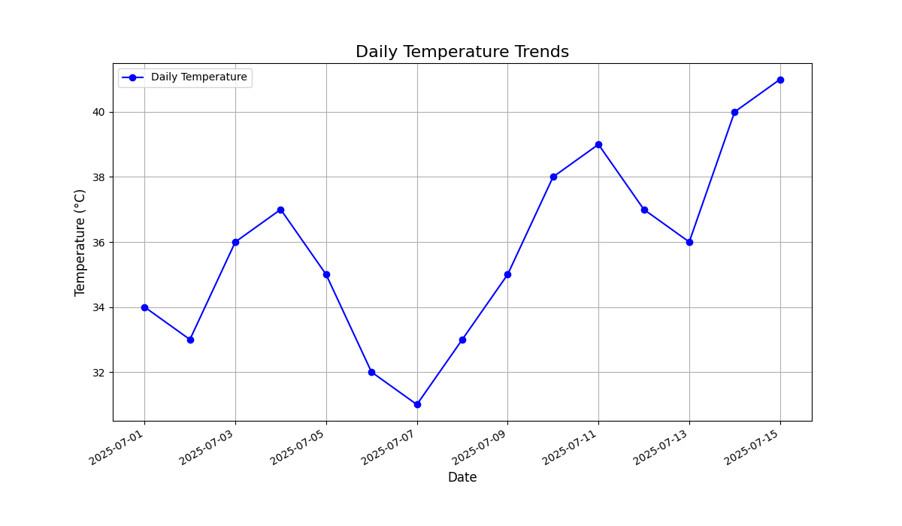

# Weather Trends Visualizer

## Project Overview

This project is a Python application that visualizes daily temperature trends from a CSV file. It addresses the problem that raw weather data in tables is difficult to interpret. By creating line charts, users can easily identify temperature fluctuations, patterns, and anomalies over time.

## Features

-   **User-friendly input**: Prompts the user to provide a path to a weather data CSV file.
-   **Robust Data Loading**: Uses the `pandas` library to load and parse data.
-   **Data Validation**: Checks for required 'Date' and 'Temperature' columns and handles potential file errors.
-   **Clear Visualization**: Generates a clean and informative line chart using `matplotlib`.
-   **Customized Chart**: The chart includes a title, axis labels, and a grid for enhanced readability.
-   **Saves Output**: Automatically saves the generated chart as a PNG image file (`temperature_trends.png`).

## Project Structure

```
weather-visualizer/
├── data/
│   └── weather_data.csv
├── README.md
├── requirements.txt
└── visualizer.py
```

## Setup and Installation

To run this project, you need Python 3 and the libraries listed in `requirements.txt`.

**1. Clone the repository:**
```bash
git clone https://github.com/your-username/weather-visualizer.git
cd weather-visualizer
```

**2. Create a virtual environment (recommended):**
```bash
python -m venv venv
source venv/bin/activate  # On Windows, use `venv\Scripts\activate`
```

**3. Install the required libraries:**
```bash
pip install -r requirements.txt
```

## How to Run the Project

1.  Make sure you have a CSV file with 'Date' and 'Temperature' columns. A sample file is provided in the `data/` directory.

2.  Run the main script from your terminal:
    ```bash
    python visualizer.py
    ```

3.  The program will prompt you to enter the path to your CSV file. For the sample data, you would enter:
    ```
    data/weather_data.csv
    ```

4.  After you provide a valid path, the script will:
    -   Load and process the data.
    -   Display the temperature trend chart in a new window.
    -   Save the chart as `temperature_trends.png` in the project's root directory.

## Sample Output

The program will generate a line chart similar to this:


